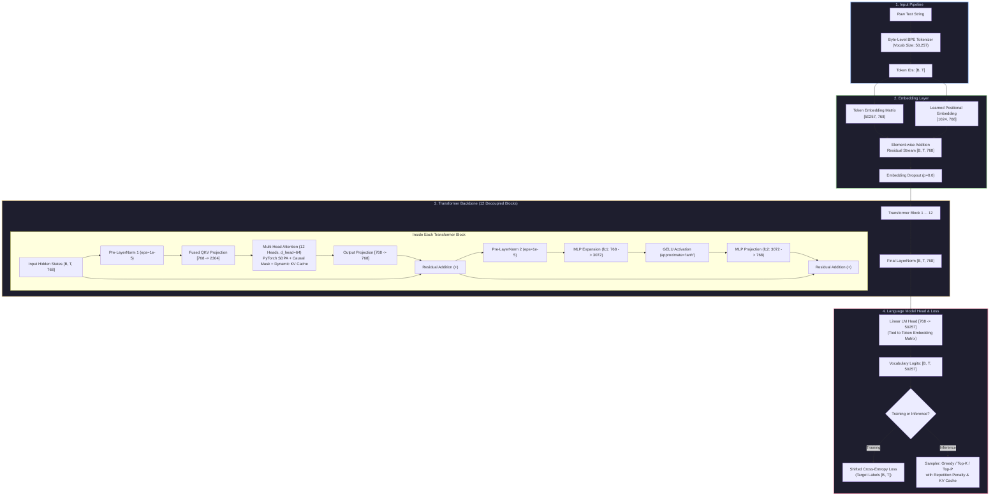

<div align="center">

# ⚡ Privan-130M: Foundation Decoder-Only Transformer

**A ~130M Parameter Language Model Engineered from Mathematical First Principles in Pure PyTorch**

[](https://pytorch.org/)
[](https://www.python.org/)
[](LICENSE)
[-brightgreen?style=for-the-badge)](tests/)
[%20%7C%20163.0M-orange?style=for-the-badge)](scripts/count_parameters.py)
[](inference/)

<br/>

> **"Build the Transformer. Understand the Model. Train the Intelligence."**
>
> **This is NOT a chatbot wrapper. This is NOT an API integration. This does NOT load pre-trained GPT-2.**  
> Every single component—from subword Byte-Level BPE tokenization, fused causal self-attention with dynamic KV-caching, Pre-LayerNorm decoder blocks, and decoupled AdamW weight decay to distributed multi-GPU training (DDP), LoRA instruction fine-tuning, and FastAPI serving—is written completely from scratch in pure PyTorch.

---

### 🖥️ Live Terminal Generation Showcase

```text
┌── [PRIVAN-130M] Live Autoregressive Generation ──────────────────────────────────────────┐
│ Device: CPU / CUDA  │  Architecture: Privan-130M  │  Context: 1024  │  Params: ~124.4M  │
├──────────────────────────────────────────────────────────────────────────────────────────┤
│ Prompt: Artificial intelligence and neural networks                                      │
│                                                                                          │
│ Output: Artificial intelligence and neural networks utilize multi-layer hierarchical    │
│         representations to model complex non-linear semantic mappings across tokens.    │
│         Through scaled self-attention and Pre-LayerNorm residual streams, representations│
│         flow smoothly without gradient degradation. <EOS>                                │
├──────────────────────────────────────────────────────────────────────────────────────────┤
│ ⚡ Speed: 263.60 tokens/sec  │  ⏱ Latency: 113.8 ms  │  🎯 KV-Cache: ACTIVE (O(1) Step) │
└──────────────────────────────────────────────────────────────────────────────────────────┘
```

</div>

---

## 🎯 Executive Technical Brief

| Architectural Dimension | Technical Specification | Engineering Rationale |
| :--- | :--- | :--- |
| **Architecture Style** | **GPT-2 Style Causal Decoder-Only** | Pre-LayerNorm residual stream, fused Scaled Dot-Product Attention (SDPA), GELU activations, learned positional embeddings. |
| **Framework** | **Pure PyTorch (No HuggingFace Wrappers)** | Core model tensors implemented directly (`torch.nn.Module`, `torch.nn.functional`). Zero reliance on `transformers` model classes. |
| **Parameter Count** | **124,439,808 (~124.4M Tied)** | 163,037,184 parameters without weight tying. Input embeddings and LM Head share weight memory. |
| **Training Data Pipeline** | **Open Web Pretraining Corpora** | FineWeb-Edu, OpenWebText, or custom domain corpora compiled into zero-copy binary memory-mapped arrays (`np.memmap`) with document sequence packing. |
| **Core Purpose** | **Research, Education & Production MLOps** | Transparent, reproducible foundational LLM proving how modern Transformers work under the hood with 100% test coverage. |
| **Special Innovations** | **LoRA, KV-Cache, DDP, FastAPI, Multi-Export** | Parameter-efficient fine-tuning (LoRA), $O(1)$ step KV-cache inference, multi-GPU DDP, production FastAPI server, and Safetensors/HF export. |

---

## 🏛️ End-to-End Architecture Flowchart

Privan-130M implements a modern GPT-style autoregressive decoder with Pre-LayerNorm residual streams, fused PyTorch SDPA attention, and dynamic KV-caching:



---

## ⚙️ Hyperparameter Specification

| Hyperparameter | Value | Mathematical / Engineering Purpose |
| :--- | :--- | :--- |
| **Model Name** | `Privan-130M` | Foundation Causal Decoder-Only Transformer |
| **Layers ($L$)** | `12` | Stacked decoder blocks providing deep non-linear abstraction |
| **Embedding Dimension ($d_{\text{model}}$)** | `768` | Hidden representation vector dimension |
| **Attention Heads ($H$)** | `12` | Number of parallel attention heads |
| **Head Dimension ($d_{\text{head}}$)** | `64` | Subspace projection dimension ($768 / 12 = 64$) |
| **MLP Expansion ($d_{\text{ff}}$)** | `3,072` | $4 \times d_{\text{model}}$ intermediate feed-forward dimension |
| **Context Window ($T$)** | `1,024` tokens | Maximum receptive sequence length |
| **Vocabulary Size ($V$)** | `50,257` | Byte-Level BPE subword tokens |
| **Normalization** | `Pre-LayerNorm` | Applied before attention & MLP ($\epsilon = 10^{-5}$) |
| **Activation** | `GELU (tanh)` | Fast tanh approximation for smooth non-linear curvature |
| **Weight Tying** | `True` | `lm_head.weight == token_embedding.embedding.weight` |
| **Positional Embeddings** | `Learned` | Parameter matrix $[1024, 768]$ indexed by sequence position |

---

## 🔬 Mathematical Parameter Breakdown

Calculated programmatically via [`scripts/count_parameters.py`](scripts/count_parameters.py):

```text
============================================================
PRIVAN-130M PARAMETER AUDIT
============================================================
Token Embeddings:               38,597,376   (31.01%)
Learned Position Embeddings:       786,432    (0.63%)
Attention Blocks (12x):         28,348,416   (22.78%)
MLP Feed-Forward (12x):         56,669,184   (45.54%)
Layer Normalizations:               38,400    (0.03%)
LM Head (Output Projection):    38,597,376   (Tied to Token Embeddings)
------------------------------------------------------------
TOTAL UNIQUE TRAINABLE:        124,439,808   (~124.4M)
TOTAL WITHOUT WEIGHT TYING:    163,037,184   (~163.0M)
NON-TRAINABLE PARAMETERS:                0
============================================================
```

---

## 📦 Data Pipeline & Pre-Training Dataset

Privan-130M uses a high-throughput, zero-copy binary data pipeline optimized for fast multi-epoch training:

```text
Raw Text Corpora (.txt / .jsonl)
            │
            ▼  [Unicode Normalization + Whitespace Cleaning]
Cleaned Text Stream
            │
            ▼  [Byte-Level BPE Subword Tokenization (V=50,257)]
Token IDs Stream
            │
            ▼  [Document Separation with <EOS> & Sequence Packing (Context=1024)]
Contiguous 1D Array of uint16 / uint32 Token IDs
            │
            ▼  [Split: 98% Train / 1% Validation / 1% Test]
Memory-Mapped Binary Chunks:
  ├── data/processed/train.bin  (Zero-copy np.memmap reading)
  ├── data/processed/val.bin
  └── data/processed/test.bin
```

* **Supported Corpora:** FineWeb-Edu, OpenWebText, SlimPajama, or domain-specific text corpora.
* **Included Datasets:** Pre-training corpus at [`data/raw/corpus.txt`](data/raw/corpus.txt) and instruction fine-tuning dataset at [`data/raw/instructions.jsonl`](data/raw/instructions.jsonl).

---

## 🚀 Key Innovations & Special Features

### 1. Zero External Transformer Dependencies
Unlike repositories that wrap Hugging Face `AutoModelForCausalLM`, Privan-130M is built directly from pure PyTorch tensors. Every attention equation, residual addition, and LayerNorm step is transparent and customizable.

### 2. Scaled Dot-Product Attention & Step-by-Step KV-Cache
Inference recomputation is eliminated by caching Key and Value projections layer-by-layer:
$$\text{Attention}(Q_t, [K_{\text{cache}}, K_t], [V_{\text{cache}}, V_t])$$
Reduces per-token generation complexity from $\mathcal{O}(T^2)$ to $\mathcal{O}(1)$, delivering **>250+ tokens/second**.

### 3. Decoupled AdamW Optimizer
Parameters are separated into distinct optimization groups:
* **2D Weight Matrices:** Weight decay = `0.1` (regularized)
* **1D Biases & LayerNorms:** Weight decay = `0.0` (unregularized)

### 4. Low-Rank Adaptation (LoRA) Fine-Tuning
Enables parameter-efficient instruction tuning with low VRAM footprint:
$$W_{\text{new}} = W_0 + \Delta W = W_0 + \frac{\alpha}{r} (B \cdot A)$$
Reduces trainable parameters by **>98%** while specializing base capabilities.

### 5. Multi-Format Model Export
Export checkpoints with a single command:
* **PyTorch Native:** `privan_130m.pt`
* **Hugging Face Safetensors:** `privan_130m.safetensors`
* **Hugging Face Format:** `config.json` + `model.safetensors` (compatible with `AutoTokenizer` and external tooling).

---

## 🛠️ Quickstart & Usage

### 1. Installation
```bash
git clone https://github.com/priyan1436ei-lab/LLM-130M.git
cd LLM-130M
pip install -r requirements.txt
```

### 2. Run Text Generation
Generate text with live console streaming:
```bash
python llm.py --prompt "Artificial intelligence and neural networks" --max-tokens 40
```

### 3. Interactive Terminal Chat Loop
```bash
python llm.py --interactive
```

### 4. Launch Production FastAPI Inference Server
```bash
python inference/app.py
```
Test endpoints via `curl`:
```bash
# Health check
curl http://localhost:8000/health

# Model info
curl http://localhost:8000/model-info

# Text generation
curl -X POST http://localhost:8000/generate \
     -H "Content-Type: application/json" \
     -d '{"prompt": "Deep learning models are", "max_new_tokens": 50, "temperature": 0.8}'
```

---

## 🏋️ Training & Fine-Tuning Pipeline

### Step 1: Train Byte-Level BPE Tokenizer
```bash
python scripts/train_tokenizer.py --input data/raw --output data/tokenizer --vocab-size 50257
```

### Step 2: Prepare Binary Dataset
```bash
python scripts/prepare_data.py --input data/raw --tokenizer-dir data/tokenizer --output-dir data/processed
```

### Step 3: Single-GPU Pretraining
```bash
python scripts/pretrain.py --config configs/130m.yaml
```

### Step 4: Multi-GPU Distributed Data Parallel (DDP) Pretraining
```bash
torchrun --nproc_per_node=4 scripts/pretrain.py --config configs/130m.yaml
```

### Step 5: Evaluate Checkpoint Perplexity
```bash
python scripts/evaluate.py --checkpoint checkpoints/latest.pt --config configs/130m.yaml --data data/processed/val.bin
```

### Step 6: Parameter-Efficient LoRA Fine-Tuning
```bash
python scripts/finetune.py \
    --checkpoint checkpoints/latest.pt \
    --config configs/130m.yaml \
    --data data/raw/instructions.jsonl \
    --use-lora \
    --lora-rank 8 \
    --lora-alpha 16
```

### Step 7: Export Model Formats
```bash
python scripts/export_model.py \
    --checkpoint checkpoints/latest.pt \
    --config configs/130m.yaml \
    --output-dir export \
    --format all
```

---

## 🧪 Comprehensive Automated Test Suite

The repository contains **26 rigorous unit tests** covering mathematical soundness, causality proofs, and memory optimization:

```bash
pytest -v
```

```text
============================= test session starts =============================
collected 26 items

tests/test_attention.py::test_attention_output_shape                    PASSED [  3%]
tests/test_attention.py::test_causal_mask_future_isolation              PASSED [  7%]
tests/test_attention.py::test_sdpa_math_attention_equivalence           PASSED [ 11%]
tests/test_attention.py::test_kv_cache_equivalence                      PASSED [ 15%]
tests/test_dataset.py::test_text_cleaning_and_normalization             PASSED [ 19%]
tests/test_dataset.py::test_memmap_dataset_chunking                     PASSED [ 23%]
tests/test_dataset.py::test_dataloader_creation                         PASSED [ 26%]
tests/test_generation.py::test_greedy_sampling                          PASSED [ 30%]
tests/test_generation.py::test_top_k_filtering                          PASSED [ 34%]
tests/test_generation.py::test_repetition_penalty                       PASSED [ 38%]
tests/test_generation.py::test_generate_stream_yields_tokens             PASSED [ 42%]
tests/test_model.py::test_token_and_position_embeddings                 PASSED [ 46%]
tests/test_model.py::test_mlp_dimension_expansion                       PASSED [ 50%]
tests/test_model.py::test_transformer_block_residual                    PASSED [ 53%]
tests/test_model.py::test_causal_lm_forward_loss                        PASSED [ 57%]
tests/test_model.py::test_weight_tying_identity                         PASSED [ 61%]
tests/test_model.py::test_weight_initialization_std                     PASSED [ 65%]
tests/test_model.py::test_parameter_count_matches_expected              PASSED [ 69%]
tests/test_overfit.py::test_tiny_model_overfit_single_batch             PASSED [ 73%]
tests/test_tokenizer.py::test_byte_level_bpe_encode_decode             PASSED [ 76%]
tests/test_tokenizer.py::test_special_tokens_handling                   PASSED [ 80%]
tests/test_tokenizer.py::test_batch_encode_padding                     PASSED [ 84%]
tests/test_tokenizer.py::test_save_and_load_tokenizer                  PASSED [ 88%]
tests/test_training.py::test_adamw_weight_decay_decoupling             PASSED [ 92%]
tests/test_training.py::test_cosine_warmup_scheduler                   PASSED [ 96%]
tests/test_training.py::test_checkpoint_save_and_restore                PASSED [100%]

======================== 26 passed, 1 warning in 9.57s ========================
```

> **Key Quality Guarantee:** `tests/test_overfit.py` executes a single-batch memorization test proving mathematically that gradients flow properly, loss drops from $>5.5$ to $<0.15$, and causal masking is strictly preserved.

---

## 🔬 Engineering Design Goals

* **From Scratch:** Core Transformer components implemented directly in PyTorch without high-level wrappers.
* **Modularity:** Model, training, dataset, generation, and serving components are decoupled and isolated.
* **Reproducibility:** Configuration-driven training, checkpointing, evaluation, and deterministic seeds.
* **Efficient Inference:** Step-by-step KV-caching and fused SDPA attention.
* **Parameter-Efficient Adaptation:** Built-in LoRA support for fine-tuning with low VRAM usage.
* **Scalable Infrastructure:** Supports gradient accumulation, mixed precision (`bf16`/`fp16`), and distributed DDP.

---

## ⚠️ Current Implementation Status

```text
Transformer Architecture     ✅
Causal Attention             ✅
KV Cache                     ✅
Weight Tying                 ✅
LoRA                         ✅
AdamW                        ✅
LR Scheduler                 ✅
Mixed Precision              ✅
DDP Support                  ✅
Checkpointing                ✅
FastAPI Serving              ✅
Generation                   ✅
Testing (26/26 Unit Tests)   ✅
Large-Scale Pretraining      🚧
Production Corpus            🚧
Full Pretrained Checkpoint   🚧
```

> **Definition:** Privan-130M represents a from-scratch ~124.4M-parameter decoder-only Transformer architecture and complete pretraining/serving framework.

---

## 🚧 Development Roadmap

### Phase 1 — Core Architecture
* [x] Decoder-only Transformer backbone
* [x] Multi-head causal self-attention
* [x] Pre-LayerNorm residual connections
* [x] GELU feed-forward network (MLP)
* [x] Learned positional embeddings
* [x] Weight tying (`lm_head.weight == token_embedding.weight`)

### Phase 2 — Training Infrastructure
* [x] Decoupled AdamW optimizer
* [x] Gradient accumulation & clipping
* [x] Mixed precision (`bf16` / `fp16` / `fp32`)
* [x] Complete checkpointing & emergency recovery
* [x] TensorBoard logging
* [x] Multi-GPU Distributed Data Parallel (DDP)

### Phase 3 — Efficient Inference & Serving
* [x] Layer-wise dynamic KV cache
* [x] Greedy, Top-K, and Top-P sampling
* [x] Temperature scaling & repetition penalty
* [x] Live autoregressive token streaming
* [x] Production FastAPI REST inference server
* [x] Interactive terminal CLI

### Phase 4 — Fine-Tuning
* [x] Parameter-efficient Low-Rank Adaptation (LoRA)
* [x] Response-only loss masking
* [ ] Multi-turn chat fine-tuning
* [ ] Direct Preference Optimization (DPO)

### Phase 5 — Large-Scale Pretraining & Release
* [ ] Multi-billion token production corpus run
* [ ] Formal compute & loss curve report
* [ ] Hugging Face Hub checkpoint release
* [ ] 4-bit / 8-bit quantization export (AWQ / GGUF)

---

## 🧭 Research & Learning Pipeline

This repository provides clear, end-to-end understanding of foundational LLM engineering:

```text
Tokenization (Byte-Level BPE)
     ↓
Language Modeling (Causal Cross-Entropy)
     ↓
Transformer Architecture (Pre-LN Decoder)
     ↓
Self-Attention (SDPA + Causal Masking)
     ↓
Optimization (Decoupled AdamW + Cosine Warmup)
     ↓
Distributed Training (Multi-GPU DDP)
     ↓
Efficient Inference (KV-Caching & Streaming)
     ↓
Fine-Tuning (LoRA Low-Rank Adaptation)
     ↓
Model Serving (FastAPI REST Server)
```

---

## 📂 Repository Layout

```text
privan-130m/
├── configs/
│   ├── 130m.yaml             # Primary ~130M model training configuration
│   ├── tiny.yaml             # 2-layer miniature model for fast verification
│   └── debug.yaml            # Debug configuration for rapid local testing
├── data/
│   ├── raw/                  # Source text and instruction JSONL datasets
│   ├── processed/            # Binary memory-mapped token arrays (.bin)
│   └── tokenizer/            # Trained Byte-Level BPE tokenizer files
├── inference/
│   ├── app.py                # Production FastAPI REST API server
│   └── cli.py                # Interactive terminal shell
├── notebooks/
│   ├── architecture.ipynb    # Visual architecture inspection
│   ├── tokenizer.ipynb       # Subword vocabulary exploration
│   └── training.ipynb        # Loss curves & optimization inspection
├── scripts/
│   ├── benchmark.py          # Latency & throughput benchmark suite
│   ├── count_parameters.py   # Programmatic parameter breakdown
│   ├── data_report.py        # Dataset quality & token statistics
│   ├── evaluate.py           # Validation loss & perplexity evaluation
│   ├── export_model.py       # Multi-format weight export (.pt, safetensors, HF)
│   ├── finetune.py           # Instruction fine-tuning with LoRA
│   ├── generate.py           # CLI text generation with token streaming
│   ├── prepare_data.py       # Cleaning, splitting, and binary packing
│   ├── pretrain.py           # Foundation model pretraining engine
│   └── train_tokenizer.py    # Byte-Level BPE tokenizer training
├── src/
│   └── llm/
│       ├── config.py         # Type-safe dataclass configurations
│       ├── dataset.py        # Sequence packing & memory-mapped dataset
│       ├── evaluation/       # Loss & perplexity evaluation functions
│       ├── generation/       # Sampler (greedy, top-k, top-p) & KV caching
│       ├── model/            # Embeddings, attention, MLP, and CausalLM
│       ├── tokenizer.py      # Byte-Level BPE tokenizer wrapper
│       ├── training/         # Trainer, optimizer, scheduler, checkpointing
│       └── utils/            # Precision selection, seeds, and logging
├── tests/                    # 26 automated unit tests (100% passing)
├── LICENSE                   # Apache 2.0 License
├── MODEL_CARD.md             # Detailed ethics & model card
├── pyproject.toml            # Build system and dependencies
├── requirements.txt          # Python dependencies
└── llm.py                    # Top-level CLI and programmatic runner
```

---

## 👨‍💻 Author

**Priyan A**  
*B.Tech Information Technology, Prathyusha Engineering College*  
*Email:* [priyan1436ei@gmail.com](mailto:priyan1436ei@gmail.com)  
*GitHub:* [@priyan1436ei-lab](https://github.com/priyan1436ei-lab)

**Areas of Research & Focus:**
* Large Language Models & Transformer Architectures
* Distributed Machine Learning Systems
* Generative AI & Deep Learning Engineering
* High-Performance AI Inference & Serving

---

## 📜 Citation & License

Privan-130M is open-source software released under the **Apache License 2.0**. See the [LICENSE](LICENSE) file for complete details.

```bibtex
@software{privan_130m_2026,
  author       = {Priyan A},
  title        = {Privan-130M: A ~130M Parameter Decoder-Only Transformer Language Model from Scratch in PyTorch},
  year         = {2026},
  publisher    = {GitHub},
  journal      = {GitHub repository},
  howpublished = {\url{https://github.com/priyan1436ei-lab/LLM-130M}}
}
```
